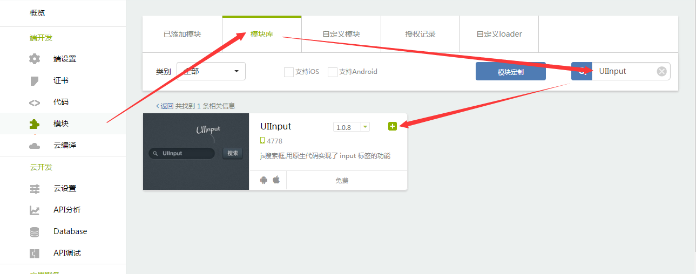

# README

## DEMO 运行流程说明

- 在云端 [APICloud](https://www.apicloud.com) 的控制台新创建一个Native应用
	
	

- 根据下面提供的**使用模块列表**，将对应的模块添加到应用
	
	

- 使用 [APICloud Studio2](https://www.apicloud.com/devtools) 或其他 SVN工具将新建的应用代码从云端下载到本地
	
	

- 下载本 DEMO 的源代码，使用 DEMO 源码覆盖上面新建的应用代码（注意在config.xml中使用新建应用的appId）

- 将代码保存并同步到云端
	
	

- 在 [APICloud](https://www.apicloud.com) 控制台云编译本项目
	
	
	
- 使用手机扫描二维码下载安装本项目，即可查看 DEMO 的运行效果

## 使用模块列表

- [UIInput](https://docs.apicloud.com/Client-API/UI-Layout/UIInput)
	
	某些 App 具有打开某一页面即可默认弹出键盘的功能，如某些登陆授权、评论页面。但是一个纯 html 的输入框标签，无法实现这一功能。为满足 APICloud 平台开发者对这一功能的需求，特推出了 UIInput 模块。

	UIInput 是一个输入框模块，开发者可通过配置相应参数来控制输入框自动获取焦点，并弹出键盘。同普通的 UI 类的模块一样，本模块也可通过 rect 来设置其位置和大小，通过 styles参数设置其样式。为增强输入框功能，模块开放了 keyboardType 参数，开发者可通过设置该参数来控制其键盘类型。