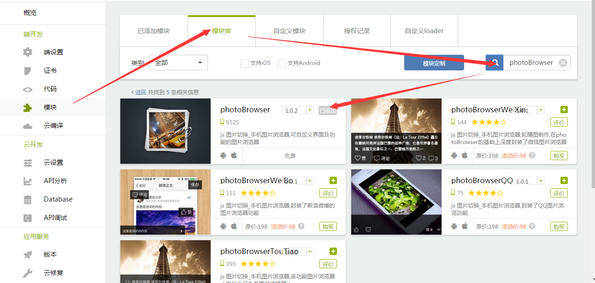

# README

本DEMO集成了第二部分的全部示范程序，由于考虑到项目的逻辑统一性，对部分子DEMO程序的源码做了一部分改动，如果想查看原始的程序范例源码，请查看本目录路径下的单独程序DEMO源码。

## 安装二维码

- android 版本
	
	
	
- iOS 版本
	
	
	
	**说明：** iOS版本为企业版，安装后需要在系统设置->通用->设备管理 中信任应用方可启动

## DEMO 运行流程说明

- 在云端 [APICloud](https://www.apicloud.com) 的控制台新创建一个Native应用
	
	

- 根据下面提供的**使用模块列表**，将对应的模块添加到应用
	
	

- 使用 [APICloud Studio2](https://www.apicloud.com/devtools) 或其他 SVN工具将新建的应用代码从云端下载到本地
	
	

- 下载本 DEMO 的源代码，使用 DEMO 源码覆盖上面新建的应用代码（注意在config.xml中使用新建应用的appId）

- 将代码保存并同步到云端
	
	

- 在 [APICloud](https://www.apicloud.com) 控制台云编译本项目
	
	
	
- 使用手机扫描二维码下载安装本项目，即可查看 DEMO 的运行效果

## 使用模块列表

- [aMap](https://docs.apicloud.com/Client-API/Open-SDK/aMap)
	
	aMap 模块封装了高德地图的原生 SDK，集成了高德地图常用基本接口；手机版原生地图，不同于 js 地图，相对于js地图而言，本模块封装的原生手机地图更加流畅迅速、动画效果更加逼真。使用此模块可轻松把高德地图集成到自己的app内，实现高德地图常用的定位、关键字搜索、周边搜索、自定义标注及气泡、查公交路线等各种功能；另外本模块已支持高德地图离线版本。 若某些带UI的接口不能满足开发设计需求，开发者（借助于原生开发者）可在本模块基础上修改少量原生代码，随心所欲的自定义高德地图所具有的原生功能，简单、轻松、快捷、高效、迅速集成高德地图，将自己的 app 和高德地图实现无缝链接。

- [ajpush](https://docs.apicloud.com/Client-API/Open-SDK/ajpush)
	
	photoBrowser 是一个图片浏览器，支持单张、多张图片查看的功能，可放大缩小图片，支持本地和网络图片资源。若是网络图片资源则会被缓存到本地，缓存到本地上的资源可以通过 clearCache 接口手动清除。同时本模块支持横竖屏显示，在本app支持横竖屏的情况下，本模块底层会自动监听当前设备的位置状态，自动适配横竖屏以展示图片。使用此模块开发者看实现炫酷的图片浏览器。

- [doubleBarChart](https://docs.apicloud.com/Client-API/UI-Layout/doubleBarChart)
	
	doubleBarChart 是一个柱状图模块，可自定义 X、Y 轴样式以及柱子的个数和颜色。本模块可监听左右拖动到头的事件，可向当前数据拼接加载、刷新等操作。同一个页面可以打开多个模块实例，以模块 id 区分。

- [UILineChart](https://docs.apicloud.com/Client-API/UI-Layout/UILineChart)
	
	UILineChart 模块可用于生成折线图(K线图)视图，并支持多条折线。开发者可自定义 X、Y 轴样式以及折线的个数和颜色。本模块还可监听左右拖动到头的事件，可向当前数据拼接加载、刷新等操作。同一个页面可以打开多个模块实例，以模块 id 区分。本模块是 lineChart 的优化版。

- [UIBarChart](https://docs.apicloud.com/Client-API/UI-Layout/UIBarChart)
	
	UIBarChart 是一个柱状图模块，可自定义 X、Y 轴样式以及柱子的个数和颜色。本模块可监听左右拖动到头的事件，可向当前数据拼接加载、刷新等操作。同一个页面可以打开多个模块实例，以模块 id 区分。本模块是 barChart 的优化版。

- [pieChart](https://docs.apicloud.com/Client-API/UI-Layout/pieChart)
	
	pieChart是一个饼图数据展示控件，可识别手势转动该饼图，旋转动画结束返回特定位置的数据库的下标。支持开发者自定义数据块样式。

- [signature](https://docs.apicloud.com/Client-API/Func-Ext/signature)
	
	signature 是一个加密模块，可以把指定字符串按照 MD5、AES、BASE64、sha1方式加密，本模块的每个接口都实现了两套方法，同步和异步。开发者可按需求自行选择接口调用。

- [UIButton](https://docs.apicloud.com/Client-API/UI-Layout/UIButton)
	
	UIButton 是 button 模块的优化升级版，用原生代码实现了一个可自定义的按钮，开发者使用此模块可以实现在一个模块视图上添加自定义按钮的功能，本模块支持手指拖动改变按钮位置功能。

- [fs](https://docs.apicloud.com/Client-API/Func-Ext/fs)
	
	fs 封装了对文件操作的接口，通过此模块可对文件或文件夹进行创建、删除、读取、写入等相关操作。

- [UIChatBox](https://docs.apicloud.com/Client-API/UI-Layout/UIChatBox)
	
	UIChatBox 模块是一个聊天输入框模块，开发者可自定义该输入框的功能。通过 open 接口可在当前 window 底部打开一个输入框，该输入框的生命属于当前 window 所有。当输入框获取焦点后，会自动弹动到软键盘之上。开发者可通过监听输入框距离底部弹动的高度，来改变聊天对话界面的高度，从而实现类似 QQ 聊天页面的功能。UIChatBox 模块是 chatBox 模块的优化版。

- [UIInput](https://docs.apicloud.com/Client-API/UI-Layout/UIInput)
	
	某些 App 具有打开某一页面即可默认弹出键盘的功能，如某些登陆授权、评论页面。但是一个纯 html 的输入框标签，无法实现这一功能。为满足 APICloud 平台开发者对这一功能的需求，特推出了 UIInput 模块。
	
	UIInput 是一个输入框模块，开发者可通过配置相应参数来控制输入框自动获取焦点，并弹出键盘。同普通的 UI 类的模块一样，本模块也可通过 rect 来设置其位置和大小，通过 styles参数设置其样式。为增强输入框功能，模块开放了 keyboardType 参数，开发者可通过设置该参数来控制其键盘类型。

- [photoBrowser](https://docs.apicloud.com/Client-API/Func-Ext/photoBrowser)
	
	photoBrowser 是一个图片浏览器，支持单张、多张图片查看的功能，可放大缩小图片，支持本地和网络图片资源。若是网络图片资源则会被缓存到本地，缓存到本地上的资源可以通过 clearCache 接口手动清除。同时本模块支持横竖屏显示，在本app支持横竖屏的情况下，本模块底层会自动监听当前设备的位置状态，自动适配横竖屏以展示图片。使用此模块开发者看实现炫酷的图片浏览器。

- [UIScrollPicture](https://docs.apicloud.com/Client-API/UI-Layout/UIScrollPicture)
	
	UIScrollPicture 是一个图片轮播模块，只需传入一组图片地址，即可实现图片轮播效果。UIScrollPicture 模块是 scrollPicture 模块的优化版。

- [UILinkedPicker](https://docs.apicloud.com/Client-API/UI-Layout/UILinkedPicker)
	
	UILinkedPicker 是自定义分级联动选择器模块，支持自定义选择器的大小、位置、内容及其级别（android暂仅最大支持3级）和数据源，可手动设置指定选中项，用于实现固定取值范围的内容选择器，多项内容之间有级联关系；本模块和 UISelector 模块相似，与之相比数据源格式不同，本模块几点信息数据支持自定义。

- [UICustomPicker](https://docs.apicloud.com/Client-API/UI-Layout/UICustomPicker)
	
	UICustomPicker 模块是一个自定义内容选择器；可自定义模块位置、内容取值范围、内容标签，设置选中内容；可用于实现固定取值范围的内容选择器，多项内容之间没有级联关系；同一个页面可以打开多个模块实例，以模块 id 区分。